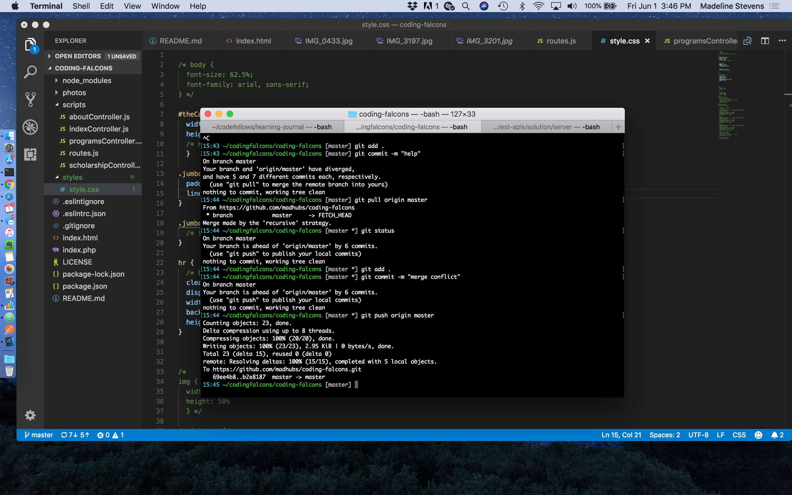

### Welcome to Coding Falcons!
Coding Falcons is a school and summer coding program for students 5-8th grade. Ivette Cortez and Madeline Stevens run the program and hope to expand throughout White Center, Georgetown and the rest of South Seattle. Test   test

### Heroku site:
http://codingfalcons.herokuapp.com

### Table of Contents
+ [Initial Setup](#preview)
+ [Bootstrap and Heroku setup](#bootstrap)
+ [Resources](#resources)

### Initial Setup:

#### Preview
Within terminal, in the root of this project folder.
``` 
live-server
```

#### packages
npm init- to create package.json
npm install- to create nodemodules

needed to update hoek dependency in node:
```
npm update && npm install
```

#### CDNs (aka- libraries)

- page.js
- jquery
- bootstrap
- Font Awesome ( twitter- <i class="fab fa-twitter-square"></i>)

### Bootstrap and Heroku setup:

#### Bootstrap:

Adding bootstrap components (resource- https://www.youtube.com/watch?v=gqOEoUR5RHg)

To incorporate bootstrap I added two things to my index.html and i immediately saw a change in my chrome browser after right clicking/open in browser:
At the top within my my style sheets section:
```html
<link rel="stylesheet" href="https://maxcdn.bootstrapcdn.com/bootstrap/3.3.7/css/bootstrap.min.css" integrity="sha384-BVYiiSIFeK1dGmJRAkycuHAHRg32OmUcww7on3RYdg4Va+PmSTsz/K68vbdEjh4u" crossorigin="anonymous">
```

At the bottom within my CDN scripts section:
```html
    <script src="https://maxcdn.bootstrapcdn.com/bootstrap/3.3.7/js/bootstrap.min.js" integrity="sha384-Tc5IQib027qvyjSMfHjOMaLkfuWVxZxUPnCJA7l2mCWNIpG9mGCD8wGNIcPD7Txa" crossorigin="anonymous"></script>
```

#### Heroku:

Setting up heroku environment. 

Attempting to use the php fix again (resource- https://www.youtube.com/watch?v=IVvU9JF6o8s): 

```php
<?php header( 'Location: /index.html' ) ; ?>
```

Ran into the issue of jquery not being recognized despite the CDN's script at the bottom of index.html. I had to add this into .eslintrc:
```
  "env": {
    "browser": true,
    "jquery": true,
    "node": true,
    "es6": true
  },
```

### Fixed 
#### A merge conflict: 



#### MIME chrome error message:

There was missing a semicolon in the server.js file, had multiple scripts for bootstrap and jquery. 

### Resources 

Bootstrap in general- https://www.youtube.com/watch?v=gqOEoUR5RHg  
Rounding corners for about the team- https://codepen.io/Madeline206/pen/JZPmMY?editors=1100  
Resizing jumbotron- https://www.codecademy.com/en/forum_questions/5398ac97282ae39e8d000be6  
Bootstrap contact us- https://bootsnipp.com/snippets/featured/contact-us 
Bootstrap footer- https://mdbootstrap.com/components/bootstrap-footer/ 
Formspree for contact us- https://formspree.io 
